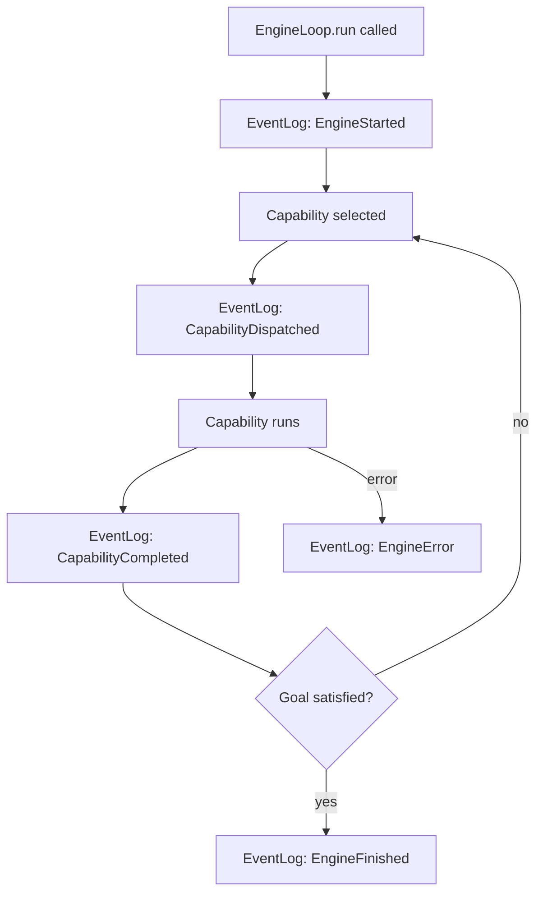

# EventLog & Replay

Every run executed by antcrew-engine produces a structured **EventLog** — an append-only record of every capability dispatch, result, HITL checkpoint, and error.

## What gets logged



## Event types

| Event class | When emitted |
|---|---|
| `EngineStarted` | Loop begins |
| `StateObserved` | After each validator pass |
| `EngineDecision` | Capability selected by the decision policy |
| `CapabilityDispatched` | Before capability.run() is called |
| `CapabilityCompleted` | After capability.run() succeeds |
| `ConditionSatisfied` | A goal condition transitions to satisfied |
| `CapabilityProgress` | Mid-run progress update (token stream, partial output) |
| `EngineFinished` | All conditions satisfied — loop exits normally |
| `EngineError` | Loop exits with STUCK / TIMEOUT / NO_PROGRESS / CANCELLED |

## Collecting events in memory

```python
from antcrew_engine.engine import EventLog

log = EventLog()
engine = EngineLoop(registry, validators, log)
engine.run(store, goal)

for event in log.events:
    print(event.kind, event.timestamp)
```

## Streaming events to the platform

`EventBusBridge` forwards each event to antcrew-platform in real time so runs appear live in the dashboard:

```python
from antcrew_engine.engine import EventBusBridge

bridge = EventBusBridge(
    platform_url="https://antcrew.org",
    api_key="acw_live_...",
    run_id="run_01HXYZ...",
)
engine = EngineLoop(registry, validators, bridge)
```

All events are visible in the run's **Trace** tab — one card per capability, with duration, cost, and produced artifact keys.

## Trace tab in the dashboard

When a run is started via `POST /engine/run`, the platform assigns a `run_id` and the engine streams events to it automatically. The run detail page exposes a **Trace** tab that renders the EventLog as a human-readable timeline:

- One card per capability, in execution order
- Status indicator (running / done) with duration and cost
- Produced artifact keys shown as chips
- Live token stream while the capability is still running

For programmatic access to the same data, use `GET /runs/{run_id}/events`.

!!! tip "Per-agent model config"
    The model shown in the Trace tab reflects the resolved model after applying `run.model_overrides` → `workspace.agent_models` → platform default. See [Model configuration](../platform/model-config.md) to configure which model each capability uses.

---

## HITL audit trail

Every HITL checkpoint — both in the supervised teams (`FlexibleHITL`) and in the engine loop (`HitlReviewer`) — is written into the tamper-evident hash chain in `TraceLog`.

### Supervised teams (FlexibleHITL)

```python
from antcrew.core.hitl import FlexibleHITL, HITLDecision, HITLAction
from antcrew.trace import TraceLog

tlog = TraceLog("trace.db")
run_id = tlog.begin_run(thread_id="t1", request="...", team="dev")

hitl = FlexibleHITL(callback=my_callback, trace_log=tlog, run_id=run_id)
# or attach after run_id is known:
hitl.attach_trace(tlog, run_id)

# gate() records to TraceLog automatically:
hitl.gate("prd_review", state)
```

The callback must return a `HITLDecision` with a `reviewer_id` field to make the decision auditable:

```python
def my_callback(checkpoint: str, state) -> HITLDecision:
    return HITLDecision(
        action=HITLAction.APPROVE,
        reviewer_id="alice@company.com",
        reason="Reviewed and approved",
    )
```

### Engine loop (HitlReviewer)

```python
from antcrew_engine.capabilities import HitlReviewer

reviewer = HitlReviewer(
    reviewed_capability="architect",
    request_review=my_review_callback,
    trace_log=tlog,      # ← wire TraceLog here
    run_id=run_id,       # ← and run_id
)
```

The `request_review` callback must include `reviewer_id` in its return dict for the decision to be attributed:

```python
def my_review_callback(content: dict) -> dict:
    # ... show content to human ...
    return {
        "verdict": "approve",
        "reviewer_id": "bob@company.com",
        "feedback": "LGTM",
    }
```

### Bridging the two models

To convert a `HITLDecision` (supervised-team model) to a `HitlDecision` dict (engine model):

```python
from antcrew_engine.engine import hitl_decision_from_flexible

engine_decision = hitl_decision_from_flexible(flexible_decision)
# Maps: APPROVE→approve, MODIFY→edit, SKIP→approve, REQUEST_CHANGES/REJECT→reject
```

### Verifying the chain

```bash
antcrew trace --verify-chain ~/.antcrew/trace.db
```

Any tampered row breaks the SHA-256 chain and the command reports the first invalid entry.

### Security contract

| Scenario | FlexibleHITL | HitlReviewer |
|---|---|---|
| Callback raises exception | → REJECT (fail closed) | `verdict` defaults to `"timeout"` → treated as reject |
| No callback configured | → REJECT | n/a — always requires `request_review` |
| `reviewer_id` missing | Decision recorded, `reviewer_id=""` | Decision recorded, `reviewer_id=""` |
