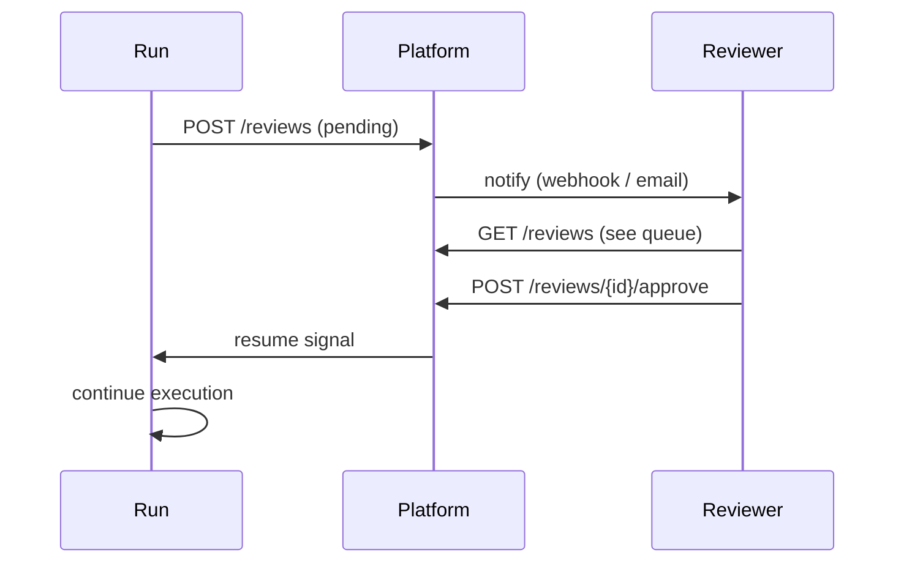

# HITL Reviews

**Human-in-the-loop (HITL)** reviews let a human approve, reject, or modify AI output before it has downstream effects.

## Creating a review

Reviews are created automatically when the engine reaches a HITL checkpoint (via the `HitlReviewer` capability), or manually from the dashboard.

## Review workflow



## Assignees

Reviews can be assigned to specific workspace members. Unassigned reviews are visible to all members with the `reviewer` role.

## Channel routing

By default every HITL review arrives in the platform dashboard (`hitl_channel: "default"`). Agents can declare a preferred channel:

```python
class MyAgent(BaseAgent):
    hitl_channel = "slack"          # routing hint stored on each HitlReview row
```

The `hitl_channel` value is stored in the `HitlReview.hitl_channel` column and included in the `hitl.review_required` event payload so external integrations (e.g. Slack bots) can filter and route reviews.

## Structured feedback

Agents can declare a Pydantic model as their feedback schema, enabling structured feedback forms instead of free-text:

```python
class ReviewFeedback(BaseModel):
    approved: bool
    comment: str
    priority: Literal["low", "medium", "high"] = "medium"

class MyAgent(BaseAgent):
    feedback_schema = ReviewFeedback
```

The JSON schema is stored in `HitlReview.feedback_schema_json`. When a reviewer submits structured feedback, it is stored in `HitlReview.structured_feedback_json` and returned in the `decision` dict passed back to the agent.

## Audit trail

Every review action (assign, approve, reject, comment) is recorded in the audit log with the reviewer's identity and timestamp.

### Tamper-evident hash chain

Every row written to the `hitl_decisions` SQLite table carries a `row_hash` — a SHA-256 hash that covers the row's own fields **and** the previous row's hash:

```
row_hash = SHA-256(prev_hash | run_id | step | decision | reviewer_id | reason | decided_at)
```

The very first row chains from the sentinel value `"genesis"`.  This creates an append-only audit trail: any modification to a row, any deletion, or any insertion in the middle of the sequence breaks the chain at that point and is detectable at any time.

#### Verifying the chain

```python
from antcrew.trace import TraceLog

tl = TraceLog("~/.antcrew/trace.db")
result = tl.verify_hitl_chain()
# {
#   "valid": True,
#   "total": 42,
#   "verified": 42,
#   "broken_at": None,
#   "message": "Chain intact — 42/42 row(s) verified."
# }
```

`valid` can be:

| Value | Meaning |
|-------|---------|
| `True` | Chain is intact; every hashed row checks out |
| `False` | Chain is broken — see `broken_at` for the first affected row id |
| `None` | Database predates v3 (no `row_hash` values yet); chain will start on next `record_hitl()` call |

#### Regulatory mapping

| Requirement | Coverage |
|---|---|
| SOC 2 CC7.2 — monitoring for unauthorised changes | Breaking the chain flags any unlogged edit to review decisions |
| GDPR Art. 5(1)(f) — integrity and confidentiality | Immutable record of who approved or rejected AI output and when |
| EU AI Act Art. 14 — human oversight | Verifiable log that human approval actually occurred and was not retrofitted |

## PlatformChannel architecture

There are two classes named `PlatformChannel` — they serve **different roles** and are not duplicates:

| Class | Module | Role |
|-------|--------|------|
| `PlatformChannel` | `antcrew.integrations.platform` | **SDK / client-side.** Used when running the SDK locally (`antcrew run` or programmatic `team.run()`). Registers the review via `POST /reviews/` on the remote platform, then HTTP-polls `GET /reviews/{id}` for the decision. |
| `PlatformChannel` | `app.core.channel` | **Server / platform-side.** Used inside the platform's uvicorn process (`app.services.runner*`). Emits `hitl.review_required` on the internal event bus and waits via in-memory Future or DB-polling. |

Never import the platform-internal class from outside the platform server — it depends on the running database engine and event bus. Use `antcrew.integrations.platform.PlatformChannel` for all SDK usage.
